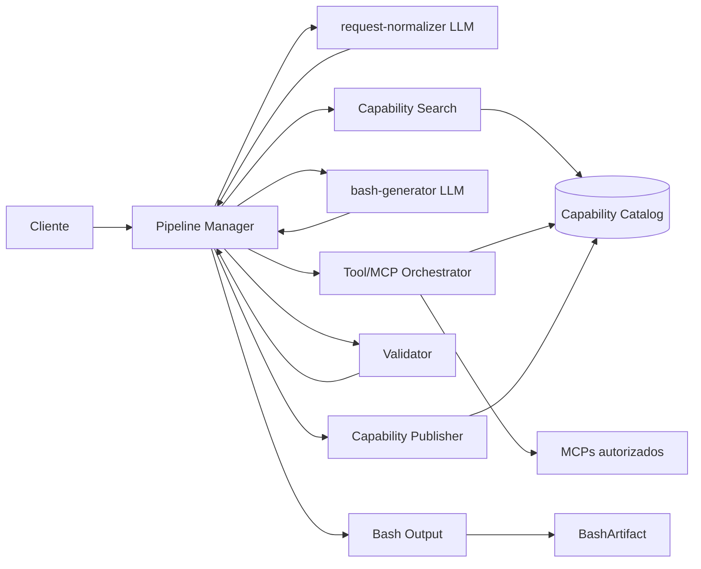

# Pipeline de geração

## Objetivo

Representar a estrutura estável do pipeline, separando etapas LLM de etapas determinísticas.

## Dependências

- [ADR-0001 — Pipeline híbrido](../adr/pipeline/pipeline-hibrido.md)
- [ADR-0002 — Protobuf e TextProto](../adr/contratos/protobuf-e-textproto.md)
- [ADR-0003 — ABI stdout/stdin](../adr/execucao/abi-stdout-stdin.md)
- [ADR-0004 — Catálogo versionado](../adr/persistencia/catalogo-capabilities.md)
- [ADR-0005 — Orquestração MCP](../adr/integracoes/orquestracao-mcp.md)
- [ADR-0006 — Publicação e materialização](../adr/pipeline/publicacao-materializacao.md)
- [ADR-0007 — Capabilities geradas](../adr/geracao/capabilities-geradas.md)

## Nível C4

`Container`

## Diagrama

## Elementos e responsabilidades

- **Pipeline Manager:** coordena request, turnos, dependências e resultados.
- **request-normalizer:** transforma linguagem natural em requisição estruturada.
- **Capability Search:** busca e poda candidatos sem LLM.
- **bash-generator:** seleciona, compõe ou gera capabilities e produz GenerationPlan.
- **Tool/MCP Orchestrator:** autoriza e executa tools.
- **Validator:** valida grafo, contratos, versões, policy e preview.
- **Capability Publisher:** publica novas capabilities de forma idempotente.
- **Bash Output:** materializa o artifact deterministicamente.
- **Capability Catalog:** persiste identidade, versões e telemetria.

## Relações relevantes

- Entre componentes, o contrato é Protobuf.
- Na fronteira LLM, a representação é TextProto.
- Generation-time tools não se tornam runtime capabilities automaticamente.
- Publisher e Bash Output são independentes após validação.

## Critérios para finalização

- Responsabilidades das etapas estão separadas.
- Relações principais possuem ADR refinado.
- O desenho não depende das decisões detalhadas ainda abertas sobre binding, efeitos, API externa ou lifecycle de modelos.
