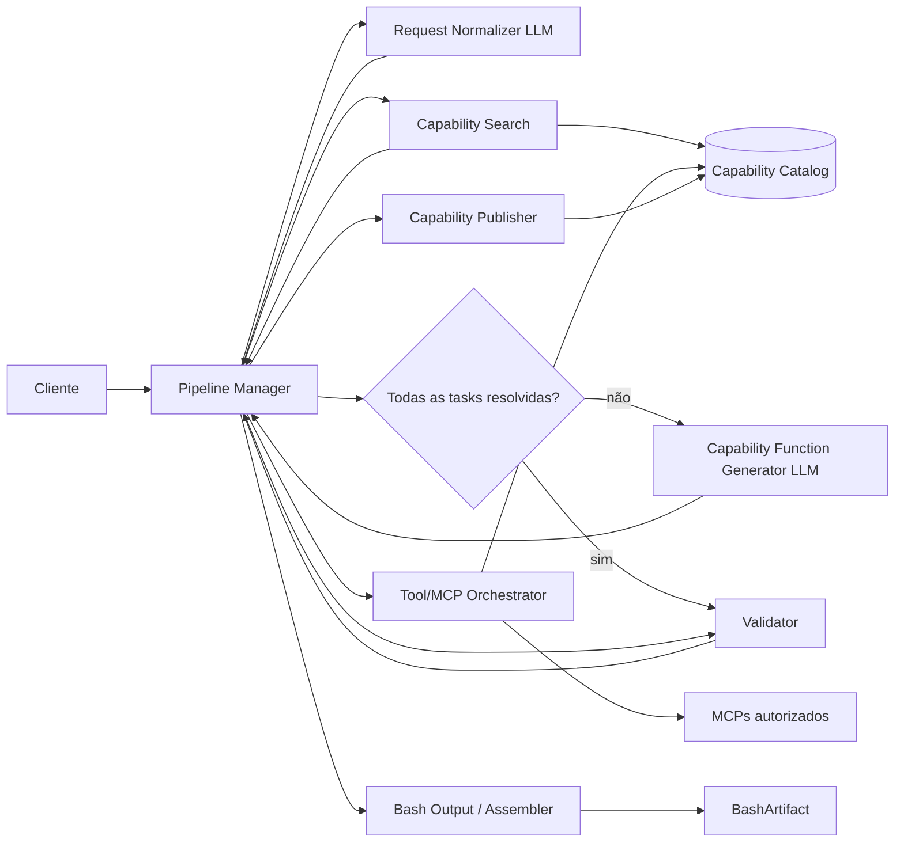

# Pipeline de geração

## Objetivo

Representar a estrutura do pipeline separando interpretação semântica, resolução de capabilities e composição determinística do artifact Bash.

## Dependências

- [ADR-0001 — Pipeline híbrido](../adr/pipeline/pipeline-hibrido.md)
- [ADR-0002 — Protobuf e TextProto](../adr/contratos/protobuf-e-textproto.md)
- [ADR-0003 — ABI JSON entre functions](../adr/execucao/abi-stdout-stdin.md)
- [ADR-0004 — Catálogo versionado](../adr/persistencia/catalogo-capabilities.md)
- [ADR-0005 — Orquestração MCP](../adr/integracoes/orquestracao-mcp.md)
- [ADR-0006 — Publicação e materialização](../adr/pipeline/publicacao-materializacao.md)
- [ADR-0007 — Capabilities geradas](../adr/geracao/capabilities-geradas.md)
- [ADR-0009 — Contrato lógico e stream](../adr/contratos/contrato-logico-e-stream.md)
- [ADR-0010 — Binding por função](../adr/execucao/binding-invocacao.md)

## Nível C4

`Container`

## Diagrama

## Elementos e responsabilidades

- **Pipeline Manager:** coordena a requisição, dependências e estados do processamento.
- **Request Normalizer:** transforma linguagem natural em tasks com input lógico, instruction e output contract.
- **Capability Search:** procura versões compatíveis por semântica e contratos sem usar LLM.
- **Capability Function Generator:** gera somente uma FUNCTION quando uma task não possui capability compatível.
- **Tool/MCP Orchestrator:** autoriza tools usadas durante geração de capability.
- **Validator:** valida DAG, contratos, versões, functions, policy e preview determinístico.
- **Bash Output / Assembler:** incorpora as functions validadas, monta deterministicamente o DAG e a função central e materializa o artifact.
- **Capability Publisher:** publica novas capabilities de forma idempotente.
- **Capability Catalog:** persiste identidade, versões, wrappers funcionais e telemetria.

## Relações relevantes

- Entre componentes do pipeline, o plano de controle permanece Protobuf.
- Na fronteira com LLM, a representação permanece TextProto.
- Entre functions do artifact, o payload funcional é JSON UTF-8.
- Toda capability resolvida apresenta uma função Bash uniforme ao assembler, independentemente de sua implementation interna.
- Tarefas independentes são representadas como nós independentes do DAG e podem ser organizadas para execução paralela.
- Fan-in é resolvido por binding determinístico de inputs; não exige capability artificial de merge quando não existe transformação funcional.
- Publicação de nova capability e materialização do artifact permanecem responsabilidades distintas.

## Critérios para finalização

- responsabilidades de interpretação, resolução, geração de capability, validação e assembly estão separadas;
- composição do script final não depende de LLM;
- a fronteira entre functions possui ABI única;
- paralelismo deriva do DAG e não de inferência;
- decisões detalhadas ainda abertas de policy, limites de concorrência e lifecycle de modelos não alteram os componentes principais do desenho.
