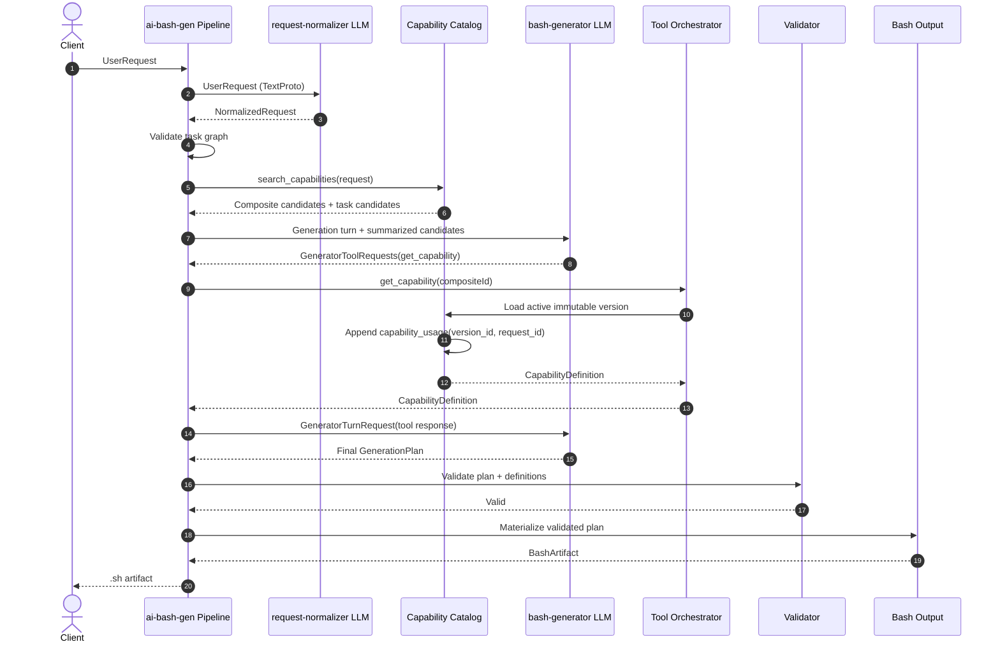
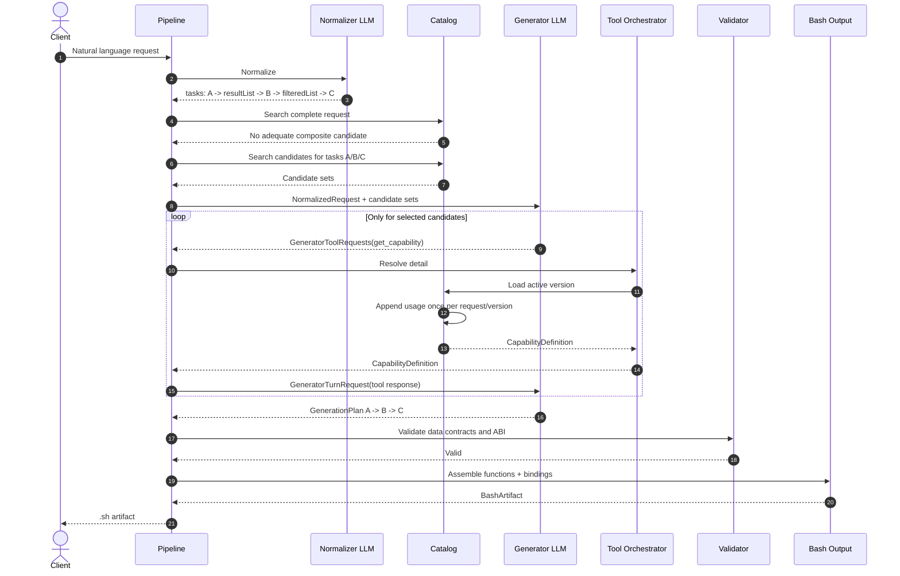
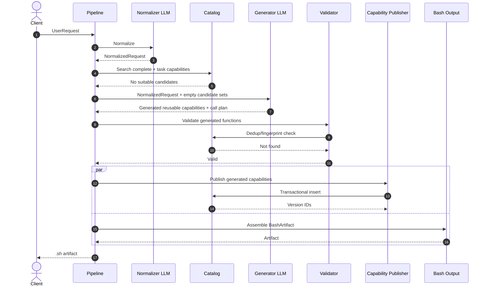
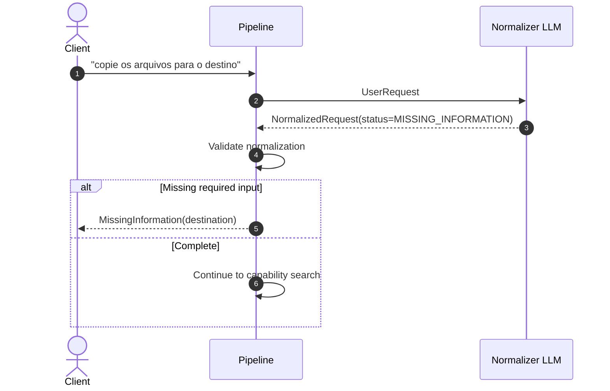
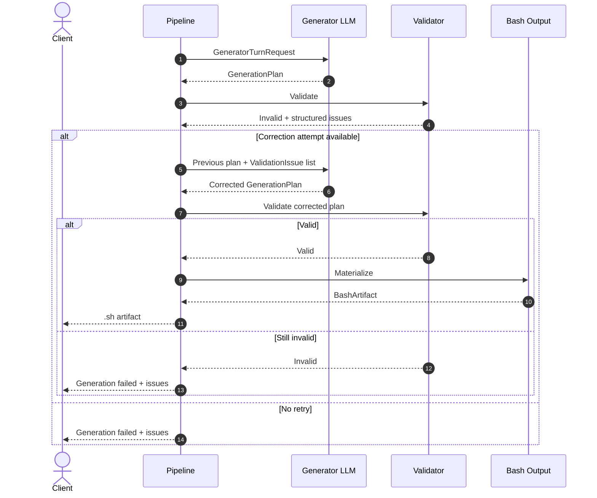
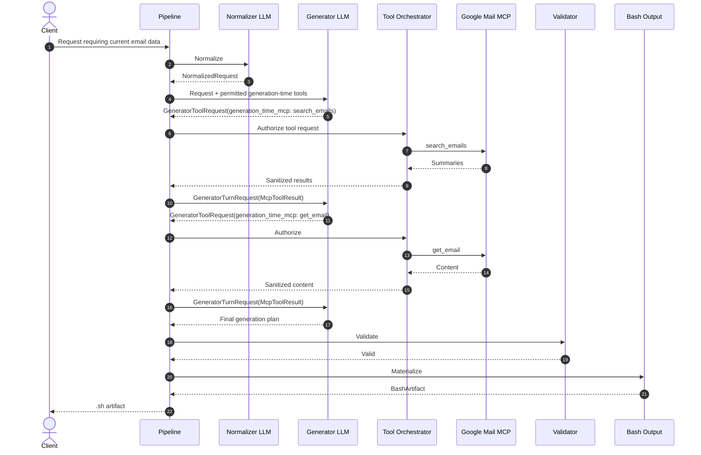
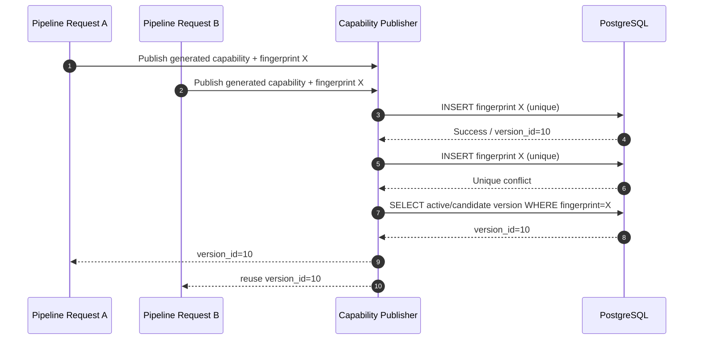
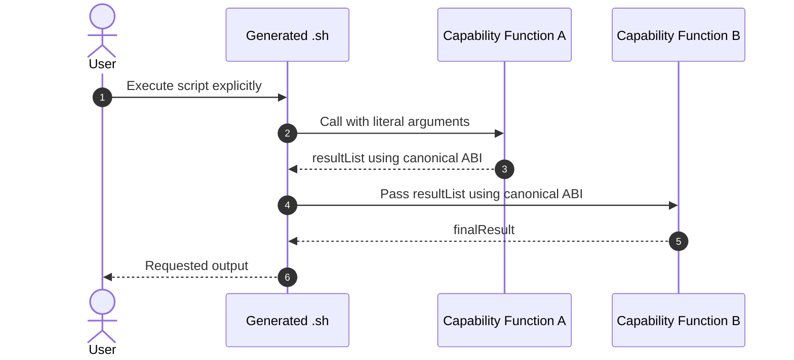

# Diagramas de sequência

Este documento mostra os principais fluxos do pipeline do `ai-bash-gen`.

Os diagramas representam a arquitetura recomendada após a revisão em [../analysis/ARCHITECTURE_REVIEW.md](../analysis/ARCHITECTURE_REVIEW.md).

## Participantes

```text
Client              cliente via Unix Socket
Pipeline            orquestrador ai-bash-gen
Normalizer LLM      request-normalizer
Catalog             Capability Catalog / PostgreSQL
Generator LLM       bash-generator
Tool Orchestrator   controle de get_capability e outros MCPs
Validator           validação determinística
Publisher           publicação idempotente de capabilities
Output              materializador do arquivo Bash
```

## Fluxo 1 — Capability composta existente

Uma capability já resolve toda a solicitação.



## Fluxo 2 — Composição de várias capabilities existentes

Nenhuma capability resolve tudo, mas as tarefas individuais possuem implementações reutilizáveis.



## Fluxo 3 — Reutilização parcial e geração de função ausente

Algumas tarefas já existem no catálogo, outra precisa ser criada.

```mermaid
sequenceDiagram
    autonumber
    actor Client
    participant P as Pipeline
    participant N as Normalizer LLM
    participant C as Catalog
    participant G as Generator LLM
    participant T as Tool Orchestrator
    participant V as Validator
    participant Pub as Capability Publisher
    participant O as Bash Output

    Client->>P: UserRequest
    P->>N: Normalize
    N-->>P: NormalizedRequest with tasks A/B/C

    P->>C: Search capabilities
    C-->>P: A found, B missing, C found

    P->>G: Request + candidates
    G-->>P: GeneratorToolRequests(get_capability A)
    P->>T: Resolve A
    T->>C: Load A version
    C-->>T: A definition
    T-->>P: A definition
    P->>G: GeneratorTurnRequest(A response)

    G-->>P: GeneratorToolRequests(get_capability C)
    P->>T: Resolve C
    T->>C: Load C version
    C-->>T: C definition
    T-->>P: C definition
    P->>G: GeneratorTurnRequest(C response)

    G-->>P: Plan using A + generated B + C

    P->>V: Validate plan and generated B
    V->>C: Dedup lookup/fingerprint
    C-->>V: No equivalent active capability
    V-->>P: Valid; B is publishable candidate

    par Independent post-validation actions
        P->>Pub: Publish B idempotently
        Pub->>C: Insert immutable candidate/version
        C-->>Pub: Published version
    and
        P->>O: Materialize BashArtifact
        O-->>P: BashArtifact
    end

    P-->>Client: .sh artifact
```

## Fluxo 4 — Nenhuma capability encontrada

Todo o comportamento precisa ser criado.



## Fluxo 5 — Informação obrigatória ausente

O pipeline deve parar cedo.



A pesquisa no catálogo e o gerador não devem ser acionados quando faltar entrada essencial.

## Fluxo 6 — Falha de validação e uma correção

O resultado do LLM é inválido, mas a política permite uma única correção.



## Fluxo 7 — Ferramenta externa necessária durante a geração

Exemplo: o usuário pede conteúdo de e-mail atual para ser incorporado à geração.



Este fluxo é diferente de um script que precisará consultar Gmail futuramente. Nesse segundo caso, Gmail precisa existir como **runtime capability** e não apenas como ferramenta do gerador.

## Fluxo 8 — Publicação concorrente de capability equivalente

Duas requisições tentam criar a mesma funcionalidade.



A deduplicação precisa ser garantida pelo banco ou lock transacional; uma busca anterior ao insert não é suficiente.

## Fluxo 9 — Runtime do arquivo Bash

A geração termina quando o arquivo é criado. Sua execução é outro fluxo.



O ABI deste fluxo está definido como `stdout -> stdin`. O tipo e a codificação do stream são validados por `DataContract`.

## Regra de topologia de streams

O ABI Unix resolve o transporte, mas cada processo possui um único `stdin`.

Na primeira versão, um stream linear é suportado diretamente:

```text
A | B | C
```

Fan-out ou fan-in não são montados implicitamente:

```text
      +--> B
A ----+
      +--> C

B ----+
      +--> D
C ----+
```

Esses casos exigem uma capability explícita de `tee`, merge/join ou materialização intermediária. O Validator rejeita um plano que tente criar essa topologia sem uma operação explícita.
